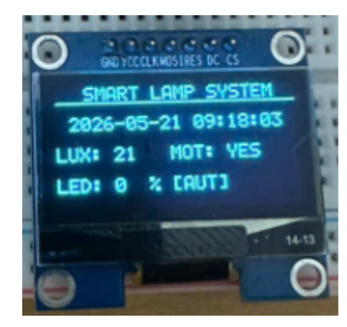
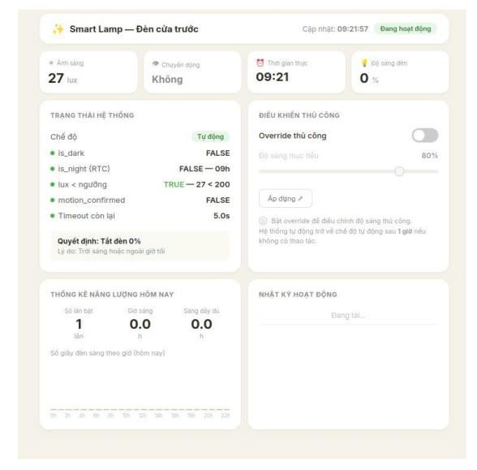
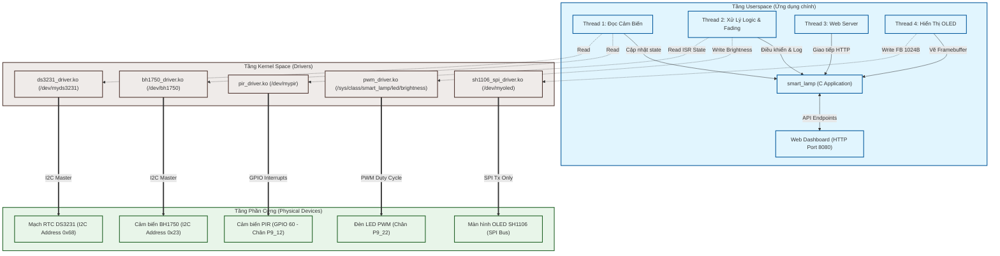

# Smart Lamp System - BeagleBone Black & Embedded Linux

Hệ thống **Đèn thông minh (Smart Lamp)** chạy trên nền tảng **BeagleBone Black** sử dụng hệ điều hành Linux nhúng tùy biến được xây dựng thông qua **Buildroot**. Dự án tích hợp các cảm biến môi trường (ánh sáng, chuyển động), màn hình hiển thị OLED, mạch thời gian thực RTC và điều khiển đèn LED thông qua cơ chế PWM để tối ưu hóa năng lượng dựa trên sự hiện diện của con người và độ sáng môi trường.

---

## 📷 Ảnh / GIF Demo

> [!NOTE]  
> Các file ảnh/gif demo được lưu trong thư mục `docs/images/`. Nếu bạn clone dự án về, vui lòng bổ sung ảnh tương ứng vào thư mục này.

| Màn hình OLED SH1106 (Trạng thái thực tế) | Web Dashboard (Giao diện giám sát từ xa) |
|:---:|:---:|
|  |  |

---

## 🛠️ Danh sách phần cứng

Hệ thống phần cứng bao gồm các linh kiện chính sau:
1. **BeagleBone Black (BBB)**: Bo mạch vi xử lý ARM Cortex-A8 (AM335x) đóng vai trò trung tâm xử lý dữ liệu và chạy nhân Linux.
2. **BH1750 (Cảm biến ánh sáng)**: Giao tiếp qua giao thức I2C (địa chỉ mặc định `0x23`), cung cấp độ sáng môi trường (Lux) thực tế về hệ thống thông qua node `/dev/bh1750`.
3. **DS3231 (Mạch thời gian thực RTC)**: Giao tiếp I2C (địa chỉ `0x68`), đồng bộ thời gian thực cho hệ thống ngay cả khi không có kết nối Internet qua node `/dev/myds3231`.
4. **HC-SR501 / SR602 (Cảm biến chuyển động PIR)**: Kết nối với chân GPIO 60 (P9_12), sử dụng ngắt cứng (Interrupt) để phát hiện sự hiện diện của con người, tương tác qua `/dev/mypir`.
5. **SH1106 (Màn hình OLED 1.3 inch)**: Giao tiếp qua giao thức SPI (chân DC/Reset GPIO), hiển thị thông tin thời gian, độ sáng môi trường và chế độ hoạt động thông qua `/dev/myoled`.
6. **Đèn LED PWM**: Được điều khiển độ sáng mịn màng (Fading) từ 0% đến 100% bằng cách thay đổi duty cycle của xung PWM trên chân P9_22 (kết nối với Driver PWM platform tương tác tại `/sys/class/smart_lamp/led/brightness`).

---

## 📐 Sơ đồ kiến trúc hệ thống

Hệ thống được thiết kế theo mô hình kiến trúc 3 tầng chuẩn cho các hệ thống nhúng Linux:



### Chi tiết hoạt động các tầng:
1. **Tầng Phần cứng (Hardware)**: Kết nối các cảm biến vật lý trực tiếp với các chân IO tương ứng trên BeagleBone Black.
2. **Tầng Drivers (Kernel Space)**: Các Module Kernel `.ko` tự viết xử lý cấu hình phần cứng ở mức thấp, quản lý tài nguyên hệ thống và cung cấp giao diện giao tiếp thông qua các file thiết bị ảo trong thư mục `/dev` hoặc thuộc tính `/sys/class`.
3. **Tầng Ứng dụng (Userspace)**: Chương trình `smart_lamp` viết bằng ngôn ngữ C sử dụng đa luồng (POSIX Threads) để đảm bảo tính thời gian thực:
   - **Thread 1**: Thực hiện lấy dữ liệu độ sáng từ BH1750 và thời gian từ DS3231 mỗi 200ms.
   - **Thread 2**: Thực hiện lọc nhiễu chuyển động PIR (yêu cầu duy trì tín hiệu liên tục 2s) và tính toán trạng thái đèn. Nếu trong khung giờ tối (19h - 6h sáng hôm sau) và cường độ sáng nhỏ hơn 200 Lux, đèn sẽ sáng 100% khi có người và giảm dần về mức nền an ninh 20% khi không có chuyển động sau 5s. Khi ngoài khung giờ này hoặc đủ sáng, đèn tắt hoàn toàn.
   - **Thread 3**: Khởi chạy một Web Server thô qua Socket, lắng nghe tại port 8080 để giao tiếp với Web Dashboard.
   - **Thread 4**: Vẽ Framebuffer và gửi tín hiệu hiển thị lên màn hình OLED mỗi 1 giây.

---

## 🚀 Hướng dẫn Build & Flash

### 1. Chuẩn bị môi trường Biên dịch chéo (Cross-compile)
Hệ thống yêu cầu cài đặt Toolchain biên dịch chéo dành cho BeagleBone Black trong Buildroot:
* **Đường dẫn compiler**: `/home/son/buildroot2/output/host/bin/arm-buildroot-linux-gnueabihf-`
* **Đường dẫn mã nguồn Kernel**: `/home/son/buildroot2/output/build/linux-custom`

### 2. Biên dịch mã nguồn
Thực hiện biên dịch trên máy Host (PC phát triển):

* **Biên dịch các Module Driver (Kernel Space)**:
  ```bash
  cd driver
  make
  ```
  Kết quả sẽ tạo ra 5 file module: `pir_driver.ko`, `pwm_driver.ko`, `bh1750_driver.ko`, `ds3231_driver.ko`, `sh1106_spi_driver.ko`.

* **Biên dịch Chương trình chính (Userspace)**:
  ```bash
  cd ..
  make
  ```
  Kết quả sẽ tạo ra file thực thi `smart_lamp`.

### 3. Deploy lên BeagleBone Black
Kết nối BeagleBone Black với PC qua cáp USB hoặc mạng LAN. Giả sử IP mặc định của board là `192.168.7.2`:

1. Copy toàn bộ driver `.ko`, file thực thi `smart_lamp` và thư mục Web `www/` lên thư mục `/root` của board:
   ```bash
   scp -r smart_lamp www/ driver/*.ko root@192.168.7.2:/root/
   ```
2. Copy script tự động chạy khi khởi động hệ thống nhúng lên thư mục init.d của board:
   ```bash
   scp S99smartlamp root@192.168.7.2:/etc/init.d/
   ```

### 4. Khởi chạy trên Board BeagleBone Black
SSH vào board:
```bash
ssh root@192.168.7.2
```
Phân quyền và chạy script khởi động:
```bash
chmod +x /etc/init.d/S99smartlamp
/etc/init.d/S99smartlamp start
```

> [!TIP]
> Script `S99smartlamp` khi khởi chạy sẽ tự động:
> 1. Thiết lập thanh ghi Pinmux triệt tiêu nhiễu xung cho PIR: `devmem 0x44E10878 32 0x27` (internal pull-down cho P9_12).
> 2. Nạp lần lượt các driver bằng lệnh `insmod`.
> 3. Khởi chạy ngầm ứng dụng `smart_lamp` và ghi log ra `/var/log/smart_lamp.log`.

---

## 🌐 API Web Dashboard (Port 8080)

Ứng dụng chính của hệ thống cung cấp 3 API HTTP dạng RESTful thô để Web Dashboard truy xuất dữ liệu:

### 1. Lấy trạng thái hệ thống hiện tại
* **Endpoint**: `GET /api/status`
* **Mô tả**: Trả về trạng thái thời gian thực của cảm biến, trạng thái điều khiển và độ sáng đèn.
* **Định dạng phản hồi (JSON)**:
  ```json
  {
    "brightness": 20,
    "motion": 0,
    "lux": 150,
    "manual": 0,
    "time": "2026-05-24 22:16:17",
    "is_dark": 1,
    "is_night": 1,
    "human_present": 0,
    "no_motion_ticks": 42,
    "auto_target": 20
  }
  ```

### 2. Lấy dữ liệu quản lý năng lượng
* **Endpoint**: `GET /api/energy`
* **Mô tả**: Trả về tổng số lần bật/tắt thiết bị và mảng lưu trữ số giây hoạt động của đèn tích lũy cho từng giờ trong ngày (24 giờ).
* **Định dạng phản hồi (JSON)**:
  ```json
  {
    "on_off_count": 8,
    "hours": [120, 240, 0, 0, 0, 0, 0, 0, 0, 0, 0, 0, 0, 0, 0, 0, 0, 0, 0, 45, 3600, 1800, 0, 0]
  }
  ```

### 3. Điều khiển thủ công thiết bị từ xa
* **Endpoint**: `GET /api/control?m=<mode>&b=<brightness>`
* **Tham số**:
  - `m`: Chế độ hoạt động (`1` - Thủ công / Manual, `0` - Tự động / Auto).
  - `b`: Độ sáng đích mong muốn khi chọn chế độ Thủ công (từ `0` đến `100`).
* **Ví dụ**: `GET /api/control?m=1&b=75` (Chuyển sang chế độ Manual và đặt độ sáng LED là 75%).
* **Phản hồi**: `OK` (HTTP 200).

---

## 👥 Thành viên nhóm thực hiện

Dự án được thực hiện bởi nhóm sinh viên sau:

1. **Nguyễn Hoài Sơn** - **MSV: B21DCCN001** (Nhóm trưởng)
   * *Nhiệm vụ*: Lập trình Driver ngắt PIR & Driver PWM platform; Thiết kế sơ đồ phần cứng; Cấu hình bản build Linux Buildroot.
2. **[Họ và tên Thành viên 2]** - **MSV: [Mã sinh viên 2]**
   * *Nhiệm vụ*: Lập trình các Driver I2C (Cảm biến ánh sáng BH1750 & Mạch thời gian thực DS3231); Biên soạn tài liệu kỹ thuật.
3. **[Họ và tên Thành viên 3]** - **MSV: [Mã sinh viên 3]**
   * *Nhiệm vụ*: Lập trình Driver SPI điều khiển màn hình OLED SH1106; Thiết kế mạch nguyên lý nguyên mẫu phần cứng.
4. **[Họ và tên Thành viên 4]** - **MSV: [Mã sinh viên 4]**
   * *Nhiệm vụ*: Thiết kế Web Dashboard giám sát; Phát triển Module Web Server HTTP Socket trong C; Tích hợp API và kiểm thử hệ thống.
